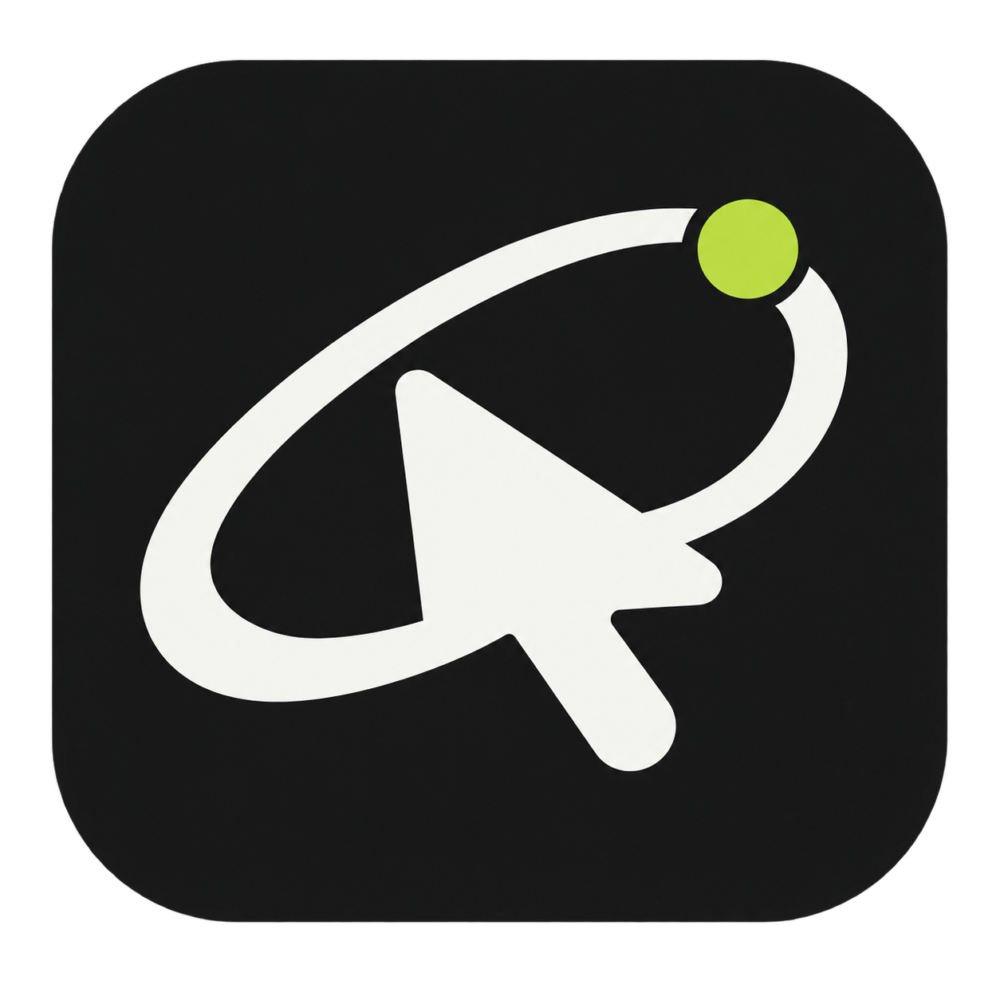
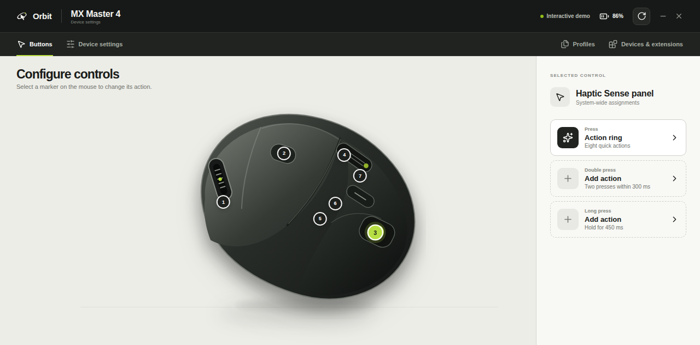

<div align="center">
  
  <h1>Orbit Mouse Studio</h1>
  <p><strong>Open-source Logitech MX Master 4 configuration for Linux.</strong></p>
  <p>Map buttons, create press / double-press / long-press actions, read battery state, and control device-tested haptics over Bluetooth or Logi Bolt.</p>

  [](https://github.com/talamar49/orbit-mouse/actions/workflows/linux-build.yml)
  [](https://github.com/talamar49/orbit-mouse/releases/latest)
  [](https://github.com/talamar49/orbit-mouse/releases)
  [](LICENSE)
  [](https://github.com/talamar49/orbit-mouse/stargazers)
</div>



> **Early release:** Orbit currently targets the Logitech MX Master 4 on x86-64 Linux. Hardware behavior can vary by connection mode, kernel, receiver, and firmware. Please [report your setup and results](https://github.com/talamar49/orbit-mouse/issues/new?template=hardware-report.yml).

## Download

Download the package for your distribution from the **[latest GitHub release](https://github.com/talamar49/orbit-mouse/releases/latest)**.

| Distribution | Package | Install |
|---|---|---|
| Any modern x86-64 Linux | `.AppImage` | `chmod +x Orbit-Mouse-Studio-*.AppImage && ./Orbit-Mouse-Studio-*.AppImage` |
| Ubuntu, Debian, Mint, Pop!_OS | `.deb` | `sudo apt install ./Orbit-Mouse-Studio-*.deb` |
| Fedora, RHEL, Rocky | `.rpm` | `sudo dnf install ./Orbit-Mouse-Studio-*.rpm` |
| openSUSE | `.rpm` | `sudo zypper install ./Orbit-Mouse-Studio-*.rpm` |

Every release includes `SHA256SUMS.txt`. Verify a download with:

```bash
sha256sum --check SHA256SUMS.txt --ignore-missing
```

### Grant device access

Orbit needs direct access to Logitech HID endpoints and Linux `uinput`. Review and run the included permission installer once, then reconnect the mouse or Logi Bolt receiver:

```bash
curl -fsSLO https://raw.githubusercontent.com/talamar49/orbit-mouse/main/resources/install-linux-permissions.sh
less install-linux-permissions.sh
sudo bash install-linux-permissions.sh
```

The installer grants `plugdev` access to the supported Bolt receiver (`046d:c548`), direct Logitech Bluetooth `hidraw` endpoints, and `/dev/uinput`. Linux Bluetooth device paths do not expose enough model detail for udev to limit the direct-device rule to MX Master 4 alone; Orbit therefore verifies HID++ device identity in the adapter before enabling device writes.

> **Trust boundary:** membership in `plugdev` plus write access to `/dev/uinput` allows processes running as that user to inject keyboard and pointer events. This is required for global remapping and cannot be restricted to one desktop application through udev alone. Only install the rules on a trusted personal machine. If the installer adds your user to `plugdev`, log out and back in once.

If an AppImage reports that `libfuse.so.2` is missing, either install your distribution's FUSE 2 compatibility package or run it with `APPIMAGE_EXTRACT_AND_RUN=1`.

## What works today

- Live Logitech / Logi Bolt HID discovery through `node-hid`
- Button and wheel assignments with a built-in action library
- Independent **press**, **double-press**, and **long-press** actions
- Persistent global Linux actions through a `uinput` helper
- Real battery-state reads
- Device-tested HID++ `0x19B0` haptic intensity and test playback
- Per-device settings persisted locally
- Tray-resident background service and KDE login autostart
- Capability-based settings: unsupported controls stay out of the UI
- Browser-safe interactive preview for UI and driver development

## Hardware support

| Device | Status | Connection |
|---|---|---|
| Logitech MX Master 4 | Primary, device-tested adapter | Bluetooth and Logi Bolt |
| Other Logitech HID++ mice | Community driver needed | Driver-dependent |
| Keyboards and non-Logitech devices | Architecture-ready, not yet supported | Driver-dependent |

Want another model supported? Open a [device request](https://github.com/talamar49/orbit-mouse/issues/new?template=device-request.yml) or implement it through the versioned [community driver API](docs/community-drivers.md).

## Why Orbit is different

Orbit uses a capability-first device model rather than hard-coding one UI for every mouse. Drivers declare discovery, controls, telemetry, settings, commands, and contributed actions. The renderer only shows capabilities the active device actually supports.

Community drivers are reviewable source modules registered at build time, keeping hardware access explicit and auditable.

## Contributing

Hardware testers, package maintainers, designers, documentation writers, and driver authors are welcome.

1. Read [`CONTRIBUTING.md`](CONTRIBUTING.md).
2. Look for [`good first issue`](https://github.com/talamar49/orbit-mouse/labels/good%20first%20issue) or [`help wanted`](https://github.com/talamar49/orbit-mouse/labels/help%20wanted).
3. For a new device, start with [`docs/community-drivers.md`](docs/community-drivers.md).
4. Include the Linux distribution, kernel, connection type, receiver IDs, and firmware in hardware reports.

## Development

Requirements: Node.js 22.12.0 or newer, npm, `libusb-1.0` development headers, and `libudev` development headers.

```bash
git clone https://github.com/talamar49/orbit-mouse.git
cd orbit-mouse
npm ci
npm run dev
```

Build and type-check:

```bash
npm run build
```

Build AppImage, DEB, and RPM packages:

```bash
npm run build:linux
```

Outputs are written to `release/`. Pushes to `main` run the same build, increment the patch version, generate checksums, and publish all packages in a versioned GitHub Release.

See [`docs/architecture.md`](docs/architecture.md) for the architecture and trust boundaries.

## Hardware notes

The MX Master 4 profile is based on Logitech's published specification: six programmable controls, a 200–8,000 DPI Darkfield sensor in 50 DPI increments, MagSpeed / SmartShift, thumb wheel, Easy-Switch, and Haptic Sense. Haptics use HID++ feature `0x19B0`; the currently verified waveforms are `DampStateChange` (`1`) and `SubtleCollision` (`4`). Logitech has not published this feature in the public HID++ specification, so Orbit treats it as device-tested, reverse-engineered behavior.

## License and trademarks

Orbit is released under the [MIT License](LICENSE).

Orbit is an independent community project and is not affiliated with or endorsed by Logitech. Logitech, MX Master, Logi Bolt, and Options+ are trademarks of Logitech International S.A.
